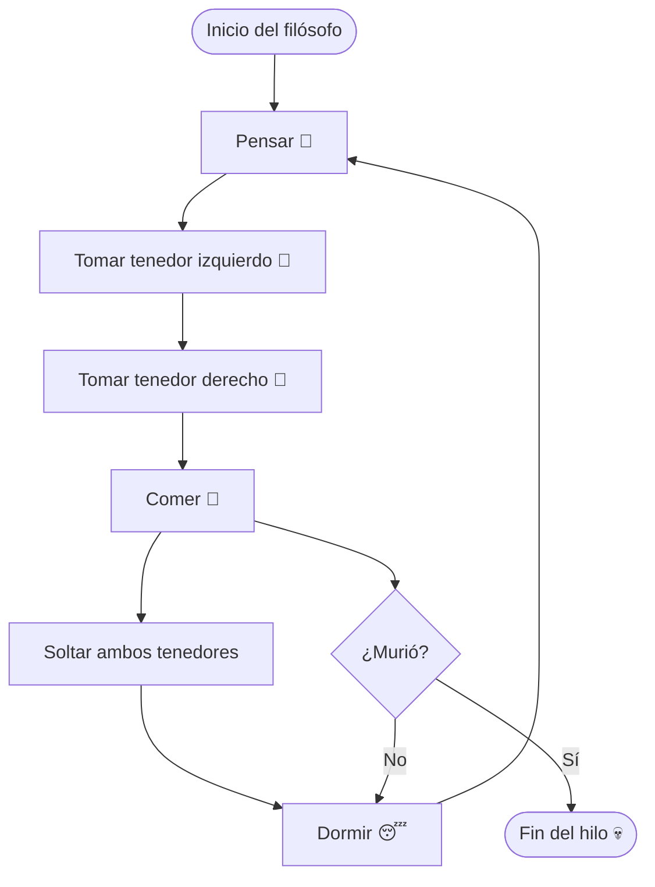
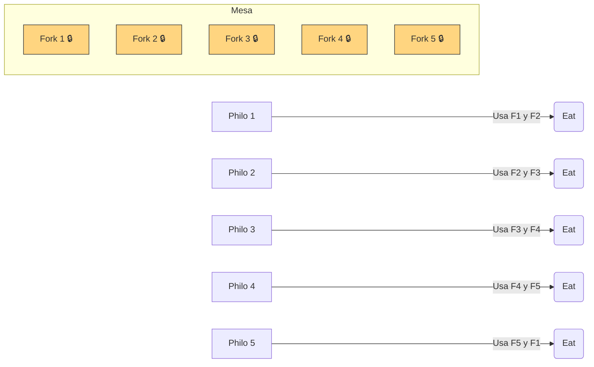

# 🧘 Philosophers - 42

**Philosophers** es un proyecto del cursus 42 que introduce los conceptos de **concurrencia, sincronización** y **multithreading** en C.  
Su objetivo es simular el famoso *Problema de los Filósofos Comensales*, donde varios filósofos deben comer, pensar y dormir sin caer en un **deadlock** ni en condiciones de carrera.

---

## 🧠 Teoría general

### 🍝 El problema de los filósofos

Cinco filósofos se sientan en una mesa redonda.  
Cada uno tiene un plato y un tenedor a su lado.  
Para comer, un filósofo necesita **dos tenedores** (el de su izquierda y el de su derecha).  
Después de comer, deja los tenedores y **piensa o duerme**.

El reto consiste en **coordinar las acciones de los filósofos** para que:
- No se produzcan **bloqueos mutuos (deadlocks)**.
- Ningún filósofo muera de hambre (por falta de acceso a los recursos).

---

### 🧵 Hilos (threads)

Cada filósofo se implementa como un **hilo de ejecución independiente** (`pthread`).  
Esto permite que varios filósofos actúen de forma concurrente, compartiendo recursos globales.

Ventajas de los threads:
- Comparten la misma memoria.
- Son más rápidos que los procesos.
- Necesitan **sincronización** para evitar errores.

---

### 🔒 Mutex (Exclusión mutua)

Los **mutex** (Mutual Exclusion Locks) evitan que dos hilos accedan a una sección crítica al mismo tiempo.  
En este proyecto, cada tenedor se representa por un mutex.

Ejemplo:
```c
pthread_mutex_lock(&fork);
eat();
pthread_mutex_unlock(&fork);
```

Esto garantiza que solo un filósofo pueda usar el tenedor a la vez.

---

### 💀 Deadlocks

Un **deadlock** ocurre cuando varios hilos esperan indefinidamente que otro libere un recurso.

Ejemplo típico:
1. Cada filósofo toma el tenedor de su izquierda.
2. Todos esperan el tenedor de su derecha.
3. Ninguno puede continuar → el programa se bloquea.

🧩 **Solución:**  
- Cambiar el orden de toma de tenedores.  
- Hacer que un filósofo tome primero el derecho y luego el izquierdo.  
- Limitar el número de filósofos que comen simultáneamente.

---

### ⏱️ Sincronización y tiempo

Cada filósofo tiene asociado:
- `time_to_die` → tiempo máximo sin comer antes de morir.  
- `time_to_eat` → duración de la acción de comer.  
- `time_to_sleep` → duración del descanso.  

El programa debe controlar estos tiempos **con precisión milisegundo**, utilizando funciones como `gettimeofday()` o `usleep()`.

---

## ⚙️ Instalación y compilación

### 🔧 Requisitos
- Sistema operativo: Linux o macOS  
- Compilador compatible con pthread (`gcc` o `clang`)  
- `make`

### 🏗️ Compilación

```bash
make
```

Genera el ejecutable principal:

```bash
./philo
```

Versión **bonus** (procesos + semáforos):

```bash
make bonus
```

### 🧹 Limpieza

```bash
make clean
make fclean
make re
```

---

## 💡 Uso

### 📘 Sintaxis

```bash
./philo number_of_philosophers time_to_die time_to_eat time_to_sleep [number_of_meals]
```

### 📋 Ejemplo

```bash
./philo 5 800 200 200
```

➡️ Crea 5 filósofos, cada uno:
- Muere si no come en 800 ms.  
- Come durante 200 ms.  
- Duerme durante 200 ms.

Con parámetro opcional:

```bash
./philo 5 800 200 200 7
```

➡️ Cada filósofo debe comer al menos 7 veces antes de que el programa finalice.

---

## 🖥️ Salida esperada

Durante la ejecución, el programa imprime el estado de cada filósofo con una marca de tiempo (en milisegundos desde el inicio de la simulación):

```bash
./philo 5 800 200 200
```

**Ejemplo de salida:**
```
0 1 is thinking
0 2 is thinking
1 3 is thinking
2 4 is thinking
3 5 is thinking
5 1 has taken a fork
5 1 has taken a fork
6 1 is eating
206 1 is sleeping
406 1 is thinking
...
802 3 died
```

📘 **Explicación:**
- La primera columna indica el tiempo transcurrido desde el inicio (en ms).  
- La segunda columna es el identificador del filósofo.  
- El texto final indica la acción actual:
  - `is thinking` → el filósofo está pensando.  
  - `has taken a fork` → ha tomado un tenedor.  
  - `is eating` → está comiendo.  
  - `is sleeping` → está durmiendo.  
  - `died` → el filósofo murió (fin del programa).

🧩 En la **versión bonus**, la salida es la misma, pero gestionada mediante **semáforos**, garantizando que los mensajes no se solapan ni se mezclan entre procesos.

---

## 🧱 Estructura del proyecto

```
philo/
├── Makefile
├── philo.c              → función principal y bucle general
├── init.c               → inicialización de estructuras y mutex
├── philo_eat.c          → lógica para comer
├── philo_routine.c      → ciclo de vida de cada filósofo
├── philo_monitor.c      → controla muertes y sincronización
├── utils/
│   ├── delay_utils.c
│   ├── init_utils.c
│   ├── print_utils.c
│   └── time_utils.c
└── includes/
    └── philo.h
```

Versión **bonus** (procesos + semáforos):

```
philo_bonus/
├── philo_bonus.c
├── init_bonus.c
├── process_bonus.c
├── sem_utils_bonus.c
├── monitor_bonus.c
└── includes_bonus/philo_bonus.h
```

---

## 🔄 Diagrama – Ciclo de vida de un filósofo



---

## 🔁 Diagrama – Sincronización (evitando deadlocks)



---

## 🧩 Bonus – Procesos y semáforos

La versión **bonus** reemplaza los **threads** por **procesos** y los **mutex** por **semáforos**.

### 🔸 Ventajas
- Cada filósofo es un proceso independiente.  
- Mejor aislamiento entre ejecuciones.  
- Control centralizado con semáforos para sincronizar acciones.

### 🔹 Semáforos utilizados
| Semáforo | Función |
|:-----------|:----------|
| `forks` | Controla cuántos tenedores están disponibles. |
| `print` | Evita que dos procesos impriman al mismo tiempo. |
| `death` | Detecta si un filósofo muere. |

---

## ⚙️ Complejidad y rendimiento

- Cada hilo/filósofo ejecuta un bucle infinito de tres estados: **pensar → comer → dormir**.  
- El control de tiempo y sincronización asegura que el programa sea **determinista**.  
- Complejidad: `O(n)` por filósofo en cada ciclo de rutina.  
- Sincronización gestionada con **mutex** (obligatorio) o **semáforos** (bonus).

---

## 🧱 Normas 42

- Cumple **Norminette**.  
- Sin **memory leaks**.  
- Uso correcto de `pthread`, `mutex` y `sem_open`.  
- Sin bloqueos ni condiciones de carrera.  
- Control preciso de tiempos y mensajes sincronizados.

---


